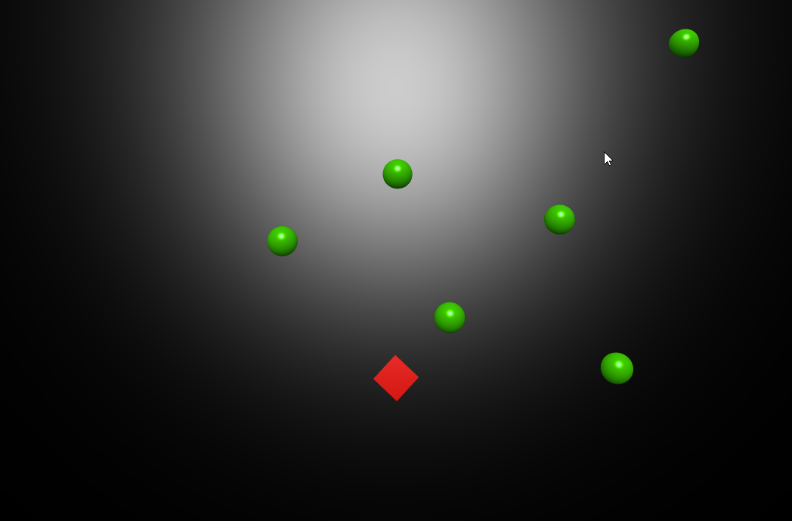

# 3d-top-down
This is a game template demonstrating the basic 2d shooter remade in Babylon.js. It is still essentially a top-down 2D game, just rendered at a slight angle in a 3D engine. There is no movement prediction nor rewind-style lag compensation.

Demonstrates:
- a server side collision check (raycast) in null engine
- creating entities that work on both client and server (thanks to null engine again)

To run the game:
```sh
npm install
npm start
## visit http://localhost:8080
```
The game should look like this:


The renderer is Babylon.js v4

The controls are
- w - up
- a - left
- s - down
- d - right
- mousemove - look around
- mouseclick - shoot

Players and green circles have 100 hp, and shots do 100 damage. After reaching 0 hp green circles respawn instantly, players respawn 1 second later.

## Bots
There are bots programmed to run around randomly in the game. To connect the bots keep the game running as done with `npm start` and then open an additional command prompt.
```sh
> node bot/index.js
```
